# Your Fired Employee Still Has Access.
## Here's Why.

JWTs, the New Enemy Problem, and Relationship-Based Access Control — demoed live with **OpenFGA + Spring Boot**.

:: note ::

My take · monolith or microservices, same rule.

<!--
Welcome. This is a talk about the gap between "we revoked access" and "access is actually gone." Set the tone: calm, confident. The whole deck follows one rule — the slide carries the anchor, I carry the explanation.
-->

---
layout: cover
color: dark
class: text-center
---

# You fire someone at 9:00am.

## When do they *actually* lose access?

<!--
It's 9am Monday. HR fires Kwame. IT revokes his access. At 9:47am, Kwame approves a GHS 50,000 payout transfer. How?
Don't answer yet — by the end of this talk you'll know exactly how it happened, and how to make sure it never happens in your system.

[NOT A NAPKIN SLIDE — emotional cold open, big type only.]
-->

---
layout: section
color: slate
---

# The conflation problem
<hr>
We use one mechanism to answer two different questions.

<!--
Two sections of setup before any code: first, the conceptual mistake almost everyone makes — then why it matters.
-->

---
layout: top-title
color: teal-light
align: c
---

:: title ::

# AuthN vs AuthZ — two different questions

:: content ::

<div class="flex items-center justify-center mt-2" style="height: 400px">

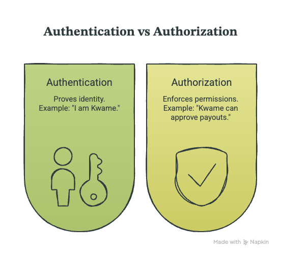{class="max-h-[400px] max-w-full w-auto rounded-lg shadow-md"}

</div>

<!--
Authentication proves WHO YOU ARE. Authorization decides WHAT YOU CAN DO. Most systems use the same mechanism for both. JWT was built to answer the first question. We conscripted it into answering the second and called it a day. That single decision is the root of everything you're about to see.
-->

---
layout: cover
color: red
class: text-center
---

# #1

## Broken Access Control

OWASP Top 10 — has held **#1** since 2021.

<!--
Before you think this is niche: OWASP ranks Broken Access Control as the number-one web application security risk. Not five, not three. Number one — and it has held that spot since 2021. Conflating authentication and authorization is one of the main reasons it stays there.

⚠️ Verify before presenting: confirm OWASP still lists Broken Access Control at #1; adjust "since 2021" if a newer edition shipped.
-->

---
layout: section
color: slate
---

# How JWT authz works
<hr>
Clean, fast, stateless — and blind to anything that changes after mint time.

---
layout: top-title
color: light
align: c
---

:: title ::

# The happy path

:: content ::

<div class="flex items-center justify-center mt-2" style="height: 360px">

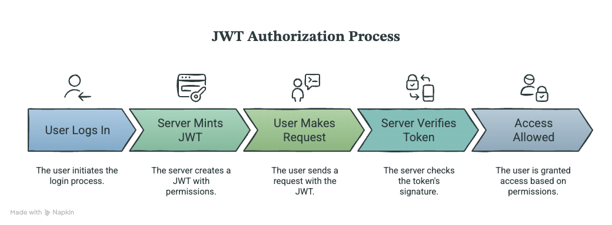{class="max-h-[360px] max-w-full w-auto rounded-lg shadow-md"}

</div>

<!--
You log in. The server mints a token with your permissions baked in as claims — role: finance. Every request after that, the server just verifies the token's signature locally. No database call. Stateless, fast, scalable. This is genuinely why we all reached for it.
-->

---
layout: top-title
color: red-light
align: c
---

:: title ::

# The same path — broken

:: content ::

<div class="flex items-center justify-center mt-2" style="height: 340px">

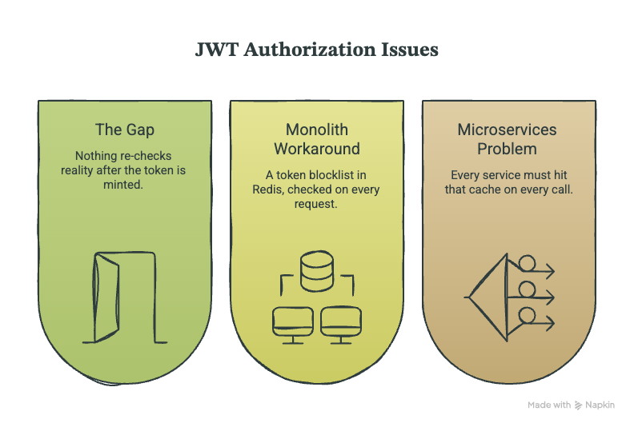{class="max-h-[340px] max-w-full w-auto rounded-lg shadow-md"}

</div>

<div class="text-center mt-3 opacity-80">
What happens when reality changes <em>after</em> mint time?
</div>

<!--
Nothing in this path ever re-checks reality. The token is the authority. When you fire Kwame in the database, this flow doesn't know — it never asks. In a monolith you can paper over it with a token blocklist in Redis — you've just made your stateless auth stateful. In microservices, every service hits that Redis on every call. You've reintroduced the bottleneck you were avoiding. The band-aid doesn't stretch that far.
-->

---
layout: section
color: red
---

# Why JWTs fail at authz
<hr>
Three problems — and one objection.

---
layout: top-title
color: light
align: c
---

:: title ::

# Problem 1 — Revocation

:: content ::

<div class="flex items-center justify-center mt-2" style="height: 400px">

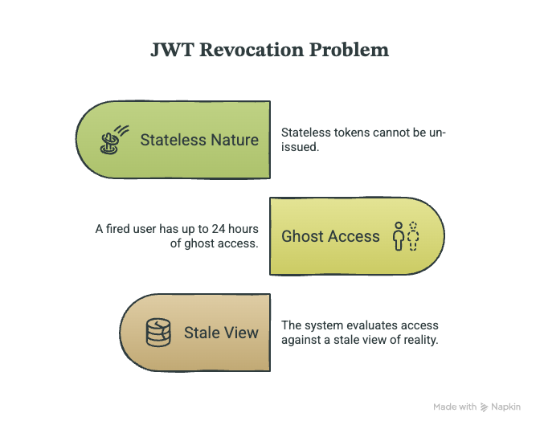{class="max-h-[400px] max-w-full w-auto rounded-lg shadow-md"}

</div>

<!--
A stateless token can't be un-issued. You can kill a session; the token stays cryptographically valid until it expires. 24-hour expiry = 24 hours of ghost access.
The paper calls this the New Enemy Problem, and it's about ORDERING: remove you from a folder, then add a sensitive doc. If the check runs against a snapshot from before your removal, you see the new doc. The fired employee is the everyday version. Google's fix — the zookie — comes later.
-->

---
layout: top-title
color: red-light
align: c
---

:: title ::

# The New Enemy Problem

:: content ::

<div class="flex items-center justify-center mt-2" style="height: 380px">

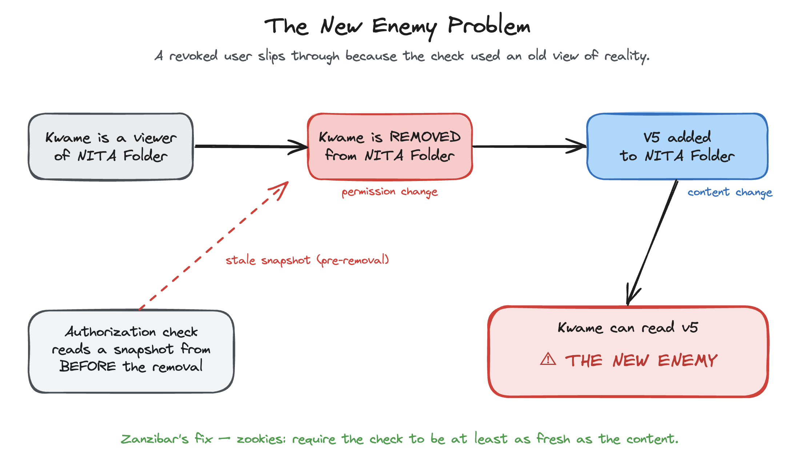{class="max-h-[380px] max-w-full w-auto rounded-lg shadow-md"}

</div>

<!--
This is the precise, ordering-based version of the New Enemy Problem — not just "the token is still valid."
1. Kwame is a viewer of the folder.
2. Kwame is REMOVED — a permission change.
3. A sensitive doc (v5) is added — a content change.
4. The authorization check reads a snapshot from BEFORE the removal — a stale view — so Kwame can read v5. He's the new enemy: recently removed, slipped through.
The fix (Slide 16): zookies require the check to be at least as fresh as the content. Hold this image in your pocket — it pays off when we reach zookies.
-->

---
layout: top-title
color: light
align: c
---

:: title ::

# Problem 2 — Scope bloat

:: content ::

<div class="flex items-center justify-center mt-2" style="height: 380px">

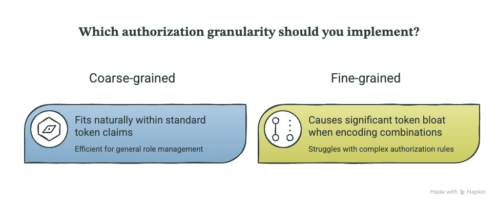{class="max-h-[380px] max-w-full w-auto rounded-lg shadow-md"}

</div>

<!--
Coarse-grained is role-level — "Kwame is Finance, can hit all finance endpoints." Fits a JWT claim. Fine-grained is resource-level and relationship-dependent — "approve payouts under GHS 1,000, only his portfolio vendors, business hours only." That's what real fintech needs. The moment you need fine-grained, the JWT bloats or you lose precision. Neither is good.
-->

---
layout: top-title
color: light
align: c
---

:: title ::

# Problem 3 — Predictability

:: content ::

<div class="flex items-center justify-center mt-2" style="height: 400px">

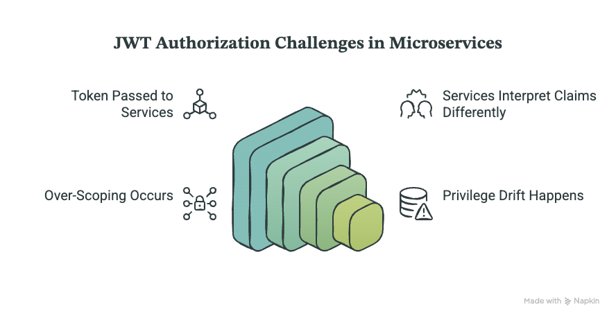{class="max-h-[400px] max-w-full w-auto rounded-lg shadow-md"}

</div>

<!--
Unique to distributed systems. You mint the token at the edge and hope every downstream service interprets the claims the same way. They won't. Service A reads "finance" one way, B another. Over-scoping becomes the default. A security problem you can't see until it bites.
-->

---
layout: two-cols-title
columns: is-6
color: slate
align: c-lt-lt
---

:: title ::

# "What if we just used a *smarter* token?"

:: left ::

### ✅ What macaroons add

Attenuation — add a restriction without contacting the issuer:

> "this token, but only `loan-001`, before 5pm, read-only"

Delegable. Fixes real JWT scope pain.

:: right ::

### ❌ What they don't fix

Still a **bearer token**. Still a fact **minted in the past**.

You still can't un-issue it.

**Same revocation problem.**

<!--
Macaroons — another Google paper, 2014. Attenuation: add a restriction, hand it on, even delegate, without contacting the issuer. Genuinely fixes some JWT scope pain.
But a macaroon is STILL a bearer token. Still a fact minted in the past. You can make the token smarter; you cannot make a bearer token know about something that happened AFTER it was issued.
🎯 This is the intellectual peak. Slow down. Pause after "a fact about the past."
-->

---
layout: cover
color: slate
class: text-center
---

# Authorization is a question about the **present**.

## A token is a fact about the **past**.

<!--
Say it slowly. This is the thesis of the whole talk. You have to ask the question at the moment you need the answer. That's what ReBAC does.
-->

---
layout: section
color: dark
---

# DEMO
<hr>
The bug, live.

<!--
Fido-inspired Spring Boot app:
1. POST /auth/login as Kwame → JWT
2. POST /payouts/disb-001/approve → 200 OK
3. POST /admin/fire/kwame → active=false, session killed
4. POST /payouts/disb-001/approve, SAME JWT → still 200 OK
5. Pause: "This is a monolith. One service, one DB. Still broken. Now imagine ten services."
-->

---
layout: cover
color: red
class: text-center
---

# Same token. Fired.

## Still approved.

<!--
That's the New Enemy Problem in four requests — and we didn't even need microservices to break it.
-->

---
layout: section
color: teal
---

# The authorization landscape
<hr>
RBAC · ReBAC · Policy engines — and one big idea.

---
layout: top-title
color: light
align: c
---

:: title ::

# Three authorization models

:: content ::

<div class="grid grid-cols-3 gap-5 mt-2">

<div class="rounded-xl border-2 border-slate-300 p-4 bg-slate-50">
<div class="text-xl font-bold mb-2">RBAC</div>
<ul class="text-sm leading-relaxed">
<li>Roles on users</li>
<li>Simple, common</li>
<li>Breaks on fine-grained</li>
</ul>
</div>

<div class="rounded-xl border-2 border-teal-400 p-4 bg-teal-50">
<div class="text-xl font-bold mb-2">ReBAC</div>
<ul class="text-sm leading-relaxed">
<li>Permissions as <b>relationships</b></li>
<li>Graph is source of truth</li>
<li>Scales, queried <b>live</b></li>
</ul>
</div>

<div class="rounded-xl border-2 border-amber-300 p-4 bg-amber-50">
<div class="text-xl font-bold mb-2">PDP / Policy</div>
<ul class="text-sm leading-relaxed">
<li>Authz as logic / rules</li>
<li>OPA, Cedar</li>
<li>Complements ReBAC</li>
</ul>
</div>

</div>

<!--
RBAC — roles on users, fine for simple systems, breaks when permissions get resource-specific. ReBAC — permissions as relationships: not "Kwame has role Finance" but "Kwame is a member of Finance" and "Finance can approve payouts." The graph is the source of truth, not the token. PDP / policy engines (OPA, Cedar) — authz as logic; complements ReBAC.
-->

---
layout: top-title
color: teal-light
align: c
---

:: title ::

# Centralized authorization

:: content ::

<div class="text-center mt-6">

One system. One question:

</div>

<AdmonitionType type="important" class="mt-4">

**"Can this user do this action on this resource — right now?"**
Asked at request time, not mint time.

</AdmonitionType>

<div class="text-center mt-6 opacity-80">
Revoke once → denied everywhere, on the next request.<br>
Same engine for a monolith or fifty services.
</div>

<!--
Today authz logic is scattered — middleware here, a role check there. Centralized authz pulls it into one system whose only job is to answer one question: can this user do this action on this resource, right now. Every service queries the same engine. Revoke once, denied everywhere on the next request. Centralized by design, built to be queried at scale without becoming a bottleneck.
-->

---
layout: section
color: teal
---

# Google Zanzibar (2019)
<hr>
The system behind Drive, Calendar, Photos, YouTube — and three ideas worth stealing.

---
layout: top-title
color: light
align: c
---

:: title ::

# Proven at planet scale

:: content ::

<div class="flex items-center justify-center mt-2" style="height: 380px">

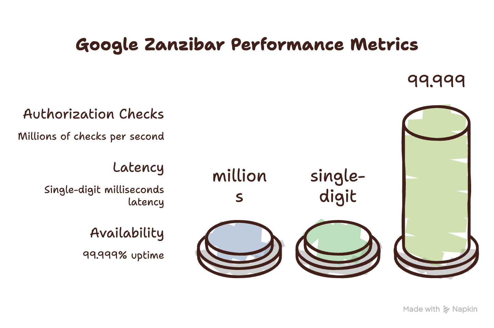{class="max-h-[380px] max-w-full w-auto rounded-lg shadow-md"}

</div>

<!--
A 2019 Google paper — the authz system behind Drive, Calendar, Photos, YouTube. Millions of checks/sec, single-digit-ms latency, five-nines. Not a whiteboard idea. When we borrow it for a loan app in Accra, we stand on something proven at planet scale. The paper gives us three ideas.
-->

---
layout: top-title
color: light
align: c
---

:: title ::

# Tuples + userset rewrites

:: content ::

<div class="flex items-center justify-center mt-2" style="height: 300px">

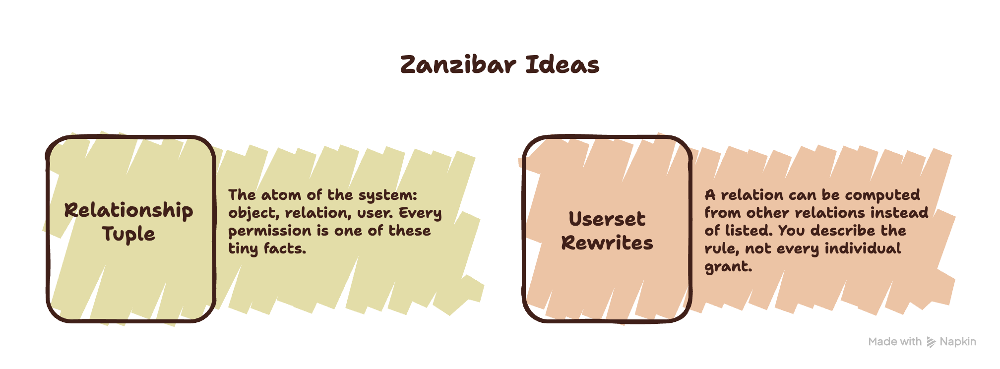{class="max-h-[300px] max-w-full w-auto rounded-lg shadow-md"}

</div>

<div class="text-center mt-4 font-mono text-sm opacity-90">
object#relation@user &nbsp;·&nbsp; e.g. <b>loan:001#approver@user:kwame</b>
</div>

<!--
Idea 1 — the relationship tuple: object, relation, user. Every permission in Google's fleet is billions of these tiny facts. Idea 2 — userset rewrites: a relation can be COMPUTED from other relations. "can_approve from parent" — we never assigned Kwame to the disbursement; we said whoever can approve the parent loan can approve the disbursement. You describe the rule, not every grant. That's why it scales.
-->

---
layout: top-title
color: light
align: c
---

:: title ::

# Zookies — the New Enemy fix

:: content ::

<div class="flex items-center justify-center mt-2" style="height: 400px">

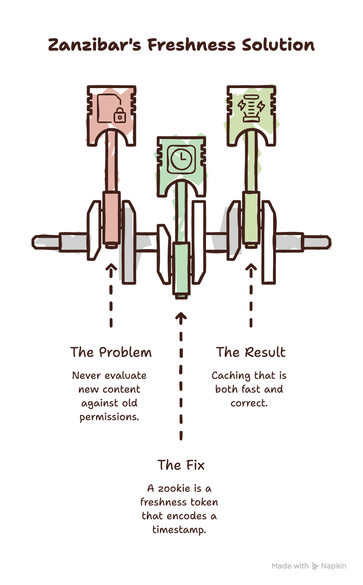{class="max-h-[400px] max-w-full w-auto rounded-lg shadow-md"}

</div>

<!--
Idea 3 solves the fired-employee problem. A zookie encodes a timestamp. Save content → save a zookie with it. Check access → "your answer must be at least as fresh as this zookie." You never evaluate new content against old permissions. The difference between caching that's fast and caching that's correct. It's what makes "revoke once, denied everywhere" actually safe.
-->

---
layout: section
color: dark
---

# DEMO
<hr>
The fix, live.

<!--
Same app, now wired to OpenFGA. Show the model first in the Playground. Three types: team, loan, disbursement. Key decision: permissions are NEVER assigned to users directly — they flow through team membership. team:finance#member as approver = everyone in finance can approve. Kwame gets it because he's a member. That indirection makes revocation instant.
Point at disbursement: "can_approve: approver or can_approve from parent" — a disbursement inherits approval from its parent loan. Kwame in finance → finance approves loan → loan is parent of disbursement → Kwame can approve. Three hops, one check, zero explicit assignment.
-->

---
layout: default
color: dark
---

# The model — `disbursement`

```text
type disbursement
  relations
    define initiator: [team#member]
    define approver: [team#member]
    define parent: [loan]
    define can_approve: approver or can_approve from parent
    define can_view: initiator or approver or can_view from parent
```

<div class="mt-4 opacity-80">
<code>can_approve from parent</code> is the inheritance — the one line a JWT can't express.
</div>

<!--
Don't read the whole model on a slide — I'll show it in the Playground. This is the one type that matters. "can_approve from parent" is the inheritance. That single line is the thing a JWT can't express.
-->

---
layout: top-title
color: teal-light
align: c
---

:: title ::

# The relationship graph

:: content ::

<div class="flex items-center justify-center mt-2" style="height: 360px">

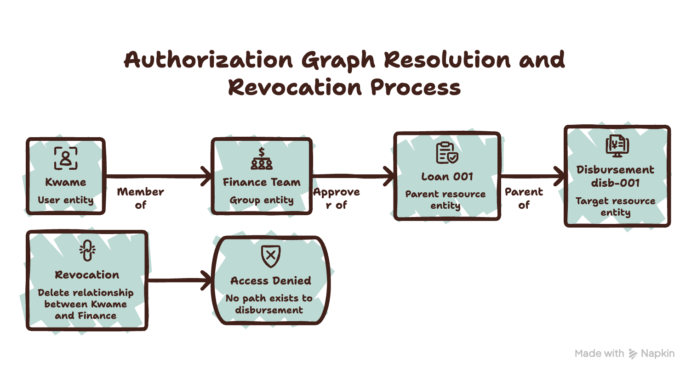{class="max-h-[360px] max-w-full w-auto rounded-lg shadow-md"}

</div>

<div class="text-center mt-3 opacity-80">
Cut <b>one edge</b> (Kwame → Finance) → no path → <b class="text-red-600">denied</b>.
</div>

<!--
In the Playground, Check tab: user:kwame / can_approve / disbursement:disb-001 → ✅ allowed. Delete the tuple "user:kwame member team:finance", re-run → ❌ not allowed. Then in the app, same JWT: POST /payouts/disb-001/approve → 403. "This check lives in OpenFGA, not the app. One engine, queried live. Revoke once, denied everywhere. Same token, different outcome — because reality changed and the system knows it."
-->

---
layout: two-cols-title
columns: is-6
color: light
align: c-ct-ct
---

:: title ::

# Fine-grained — one tuple, no token change

:: left ::

<div class="rounded-xl border-2 border-teal-400 p-5 bg-teal-50 text-center">

### ✅ Allowed

`user:kwame approver loan:loan-001`

</div>

:: right ::

<div class="rounded-xl border-2 border-red-300 p-5 bg-red-50 text-center">

### ❌ Denied

`user:kwame approver loan:loan-002`

</div>

<!--
The thing JWT can't do cleanly: scope Kwame to ONE loan. One relationship tuple — approve loan-001, not loan-002. No role change, no token reissue. Fine-grained authorization in a single line. Try encoding that in a JWT claim and watch it bloat.
-->

---
layout: section
color: slate
---

# Honesty
<hr>
When JWTs still fit — and why ReBAC isn't everywhere.

---
layout: top-title
color: light
align: c
---

:: title ::

# When JWTs still make sense

:: content ::

<div class="flex items-center justify-center mt-2" style="height: 400px">

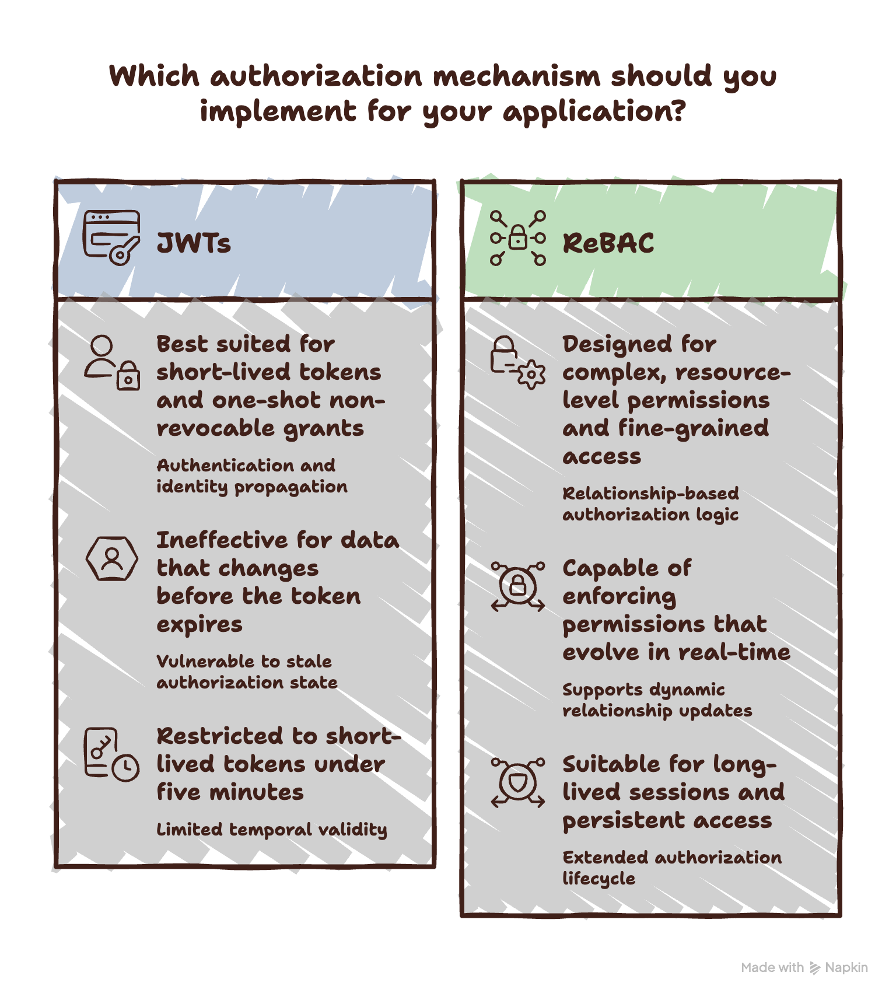{class="max-h-[400px] max-w-full w-auto rounded-lg shadow-md"}

</div>

<!--
I'm not throwing JWTs out. Excellent for short-lived tokens, one-shot non-revocable grants (email verify, reset), and propagating identity between services. That's authentication — they're great at it. Wrong tool for long-lived, fine-grained, change-before-expiry authorization. The token doesn't know your architecture — monolith or microservices, same rule.
-->

---
layout: top-title
color: light
align: c
---

:: title ::

# So why isn't everyone using ReBAC?

:: content ::

<div class="flex items-center justify-center mt-2" style="height: 400px">

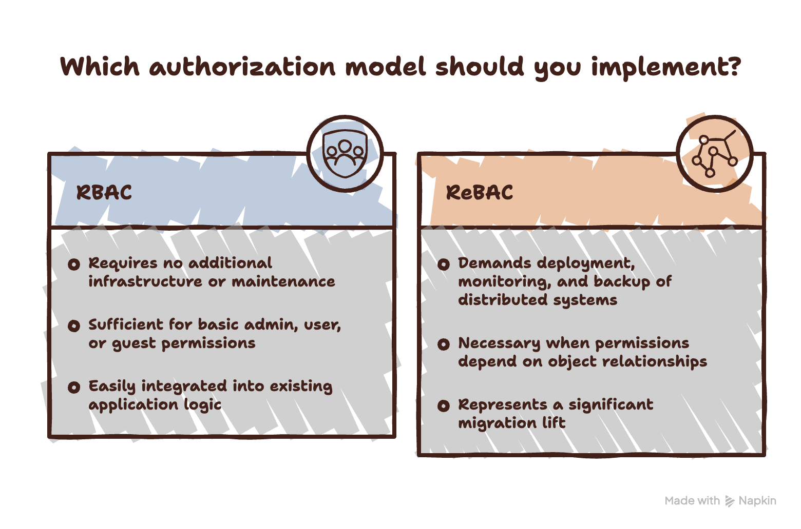{class="max-h-[400px] max-w-full w-auto rounded-lg shadow-md"}

</div>

<!--
Real reasons: (1) another distributed, stateful system to run, monitor, back up. (2) every check is now a network call — Google needed zookies + heavy caching to make it fast. (3) the honest one — RBAC is genuinely fine for most apps; admin/user/guest doesn't need a graph. (4) migration is a big lift with no shiny feature at the end.
When to reach for it, in one line: when your permissions stop being about WHO someone is and start being about WHAT they're related to. In fintech — loans, approvers, vendors, disbursements — that happens fast.
-->

---
layout: cover
color: dark
class: text-center
---

# 9:00:01am.

## Relationship deleted. Next request denied.

Not because the token changed — because **reality** did.

<!--
It's 9am Monday. Kwame is fired. With JWT authz, he has access until his token expires — hours. With ReBAC, the relationship is deleted at 9:00:01. The next request is denied. Not because the token changed. Because reality changed, and your system finally knows it.

[NOT A NAPKIN SLIDE — callback to the cold open, big type.]
-->

---
layout: top-title
color: teal-light
align: c
---

:: title ::

# Go read your auth code this week

:: content ::

<div class="text-center text-xl mt-4 leading-relaxed">

Is it answering <b>"who are you"</b> — or <b>"what can you do"</b>?

<div class="opacity-80 mt-2">If it's doing both with one token, you have homework.</div>

</div>

<div class="flex justify-center gap-8 mt-8 text-lg font-semibold">
<span>Zanzibar paper</span>
<span>OpenFGA</span>
<span>SpiceDB</span>
<span>Permify</span>
</div>

<div class="text-center mt-8 opacity-70">Thank you — questions?</div>

<!--
One ask: look at your auth code this week. "Who are you" or "what can you do"? If it's doing both with one token — monolith or microservices, doesn't matter — you have homework. Links are here, photograph the slide. Thank you.

📸 Put real URLs on this slide before presenting.
-->

---
layout: section
color: zinc
---

# Appendix
<hr>
Backup material for Q&A and the live demo.

---
layout: default
color: light
---

# Full OpenFGA model

```text
model
  schema 1.1

type user

type team
  relations
    define member: [user]
    define manager: [user]
    define can_manage: manager

type loan
  relations
    define borrower: [user]
    define credit_reviewer: [team#member]
    define risk_reviewer: [team#member]
    define approver: [team#member]
    define can_view: borrower or credit_reviewer or risk_reviewer or approver
    define can_review_credit: credit_reviewer
    define can_review_risk: risk_reviewer
    define can_approve: approver
    define can_flag: risk_reviewer or approver

type disbursement
  relations
    define initiator: [team#member]
    define approver: [team#member]
    define parent: [loan]
    define can_initiate: initiator
    define can_approve: approver or can_approve from parent
    define can_view: initiator or approver or can_view from parent
    define can_cancel: approver
```

---
layout: top-title
color: light
align: l
---

:: title ::

# Seed tuples

:: content ::

| User | Relation | Object |
|---|---|---|
| `user:kwame` | `member` | `team:finance` |
| `user:abena` | `manager` | `team:finance` |
| `user:ama` | `member` | `team:credit` |
| `user:kofi` | `member` | `team:risk` |
| `user:akosua` | `borrower` | `loan:loan-001` |
| `team:credit#member` | `credit_reviewer` | `loan:loan-001` |
| `team:risk#member` | `risk_reviewer` | `loan:loan-001` |
| `team:finance#member` | `approver` | `loan:loan-001` |
| `team:finance#member` | `initiator` | `disbursement:disb-001` |
| `loan:loan-001` | `parent` | `disbursement:disb-001` |

<div class="text-sm mt-2 opacity-80">
<b>Revoke:</b> delete <code>user:kwame · member · team:finance</code> &nbsp;·&nbsp;
<b>Fine-grained:</b> add <code>user:kwame · approver · loan:loan-001</code>
</div>

---
layout: default
color: dark
---

# Demo run order

```text
DEMO 1 (the bug — JWT)
1. POST /auth/login                  → Kwame's JWT
2. POST /payouts/disb-001/approve    → 200 OK
3. POST /admin/fire/kwame            → active=false, session killed
4. POST /payouts/disb-001/approve    → 200 OK   ← the bug

DEMO 2 (the fix — OpenFGA)
1. Check kwame/can_approve/disb-001  → allowed
2. Delete tuple kwame member finance → revoked in OpenFGA
3. Check again                       → not allowed
4. POST /payouts/disb-001/approve    → 403 (same JWT)
5. Fine-grained: kwame approver loan-001 only → loan-002 denied
```
